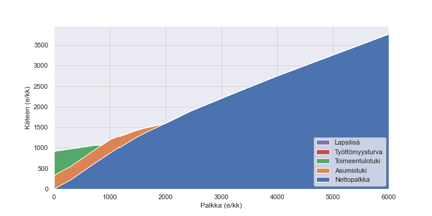
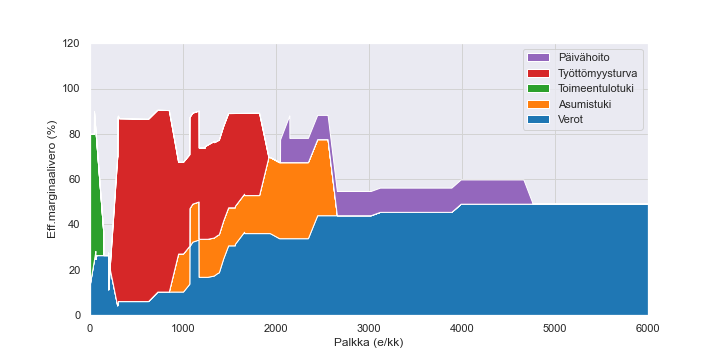

# Benefits - Python module that makes analysis of social security easy

Benefits implements Finnish social security as a Python module. It enables analysis of benefits and incentives via example cases.
The aim is to enable analysis of the scheme easily, e.g., computation of the effective tax rate.
Further, the code is implemented in a modular way to enable embedding in a more comprehensive model, such as a life cycle model.

To see an executable example, see .

Figure 1. Net income as a function of wage taking into account social security benefits and taxation.

Figure 2. Effective marginal tax rate as a function of wage taking into account social security benefits and taxation.

## References

	@misc{fin_benefits,
	  author = {Antti J. Tanskanen},
	  title = {Benefits - Python module that makes analysis of social security easy},
	  year = {2019},
	  publisher = {GitHub},
	  journal = {GitHub repository},
	  howpublished = {\url{https://github.com/ajtanskanen/benefits}},
	}
	
The library is described in articles
    
    @article{tanskanen2020tyollisyysvaikutuksien,
      title={Ty{\"o}llisyysvaikutuksien arviointia teko{\"a}lyll{\"a}: Unelmoivatko robotit ansiosidonnaisesta sosiaaliturvasta},
      author={Tanskanen, Antti J},
      journal={Kansantaloudellinen aikakauskirja},
      volume={2},
      pages={292--321},
      year={2020}
    }